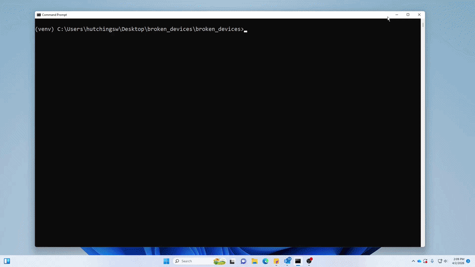

# broken-devices
> Python script that automates broken device workflows in a school district, including reporting, email notifications, inventory updates, and repair requests.
> 
> ⚠️ Internal tool only: This is designed for use by THS/TMS technicians only.
> 
This script automates the tasks required when receiving a broken device. It prompts the user for information regarding the broken device, then uses playwright to automate browser-based workflows such as reporting the damaged device, checking it in, and submitting a repair order. By using this script, our broken device reporting has sped up from ~3 minutes to ~1.5 minutes.

## Demo



## Requirements
- Windows 10/11
- Python 3.10+

## Installation & Setup
  1. Ensure your label printer is set as your default printer
  2. Download this repo and save it to your desktop

## First Use
  1. In the command prompt, navigate to where you have this repo saved

  ```
  cd Desktop\broken_devices-main
  ```

  2. Run the following commands sequentially. This will ensure you have all necessary packages installed

  ```
  py -m venv venv
  venv\Scripts\activate.bat
  pip install -r requirements.txt
  playwright install
  ```

  3. Run the main script

  ```
  py broken_device_script.py
  ```

  4. Upon first running the program, you will be prompted to enter your credentials for each step. After that, the program will save them to Windows Credential Locker using keyring. If you entered these incorrectly, you can simply edit them by running the program with the `--reset-credentials` argument.

```
py broken_device_script.py --reset-credentials
```

  ## Quick Start (Subsequent Uses)

  After your first successful use of the program, you can run it again with the following:

  ```
  cd Desktop\broken_devices-main
  venv\Scripts\activate.bat
  py broken_device_script.py
  ```

  This will change your directory to the project folder, start the virtual environment, and run the script.

## CLI Arguments
To reset sensitive information (usernames/passwords), use the `--reset-credentials` arg:

```
py broken_device_script.py --reset-credentials
```

To reset non-confidential information such as your mailing list, initials, and school, use `--reset-email-info`.

```
py broken_device_script.py --reset-email-info
```

Alternatively, you can edit this in the `emailinfo.json` file.

## Troubleshooting
### pip not recognized as a command
If pip is not being recognized as a command, you may need to add a couple paths to your system's PATH environment variable  
  * Search for "environment variables" in the Windows search bar and open the first result
  * Click Environment Variables, and select the Path variable under User Variables
  * Click New and add the path to your Python installation (ex: C:\Users\yourname\AppData\Local\Programs\Python\Python313)
  * Also add the path to the Scripts folder within your Python installation (ex: C:\Users\yourname\AppData\Local\Programs\Python\Python313\Scripts)
  * You can then restart command prompt and type the following to ensure pip is working

    ```
    pip --version
    ```

### Execution of scripts is disabled
If your system is blocking the execution of the venv exe, you'll need to do the following:
  * Open Windows Security, and go to Virus & threat protection
  * Click "Manage settings" under Virus & threat protection settings
  * Under Exclusions, click "Add or remove exclusions"
  * Add the path to your Python folder (ex: C:\Users\yourname\AppData\Local\Programs\Python)
  * Add the path to the project folder (ex: C:\Users\yourname\Desktop\broken_devices)

